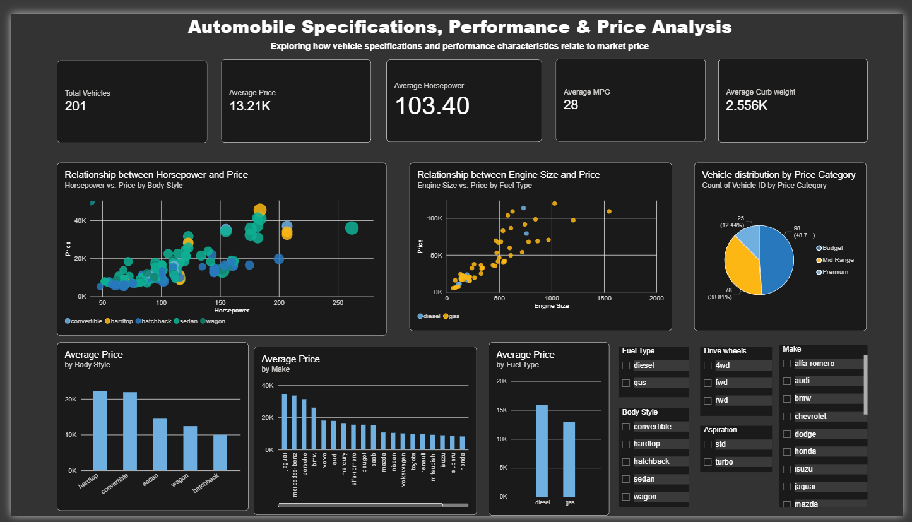
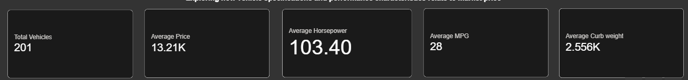
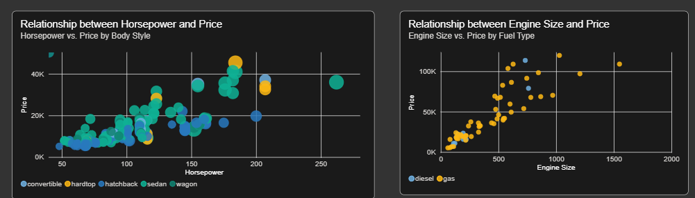
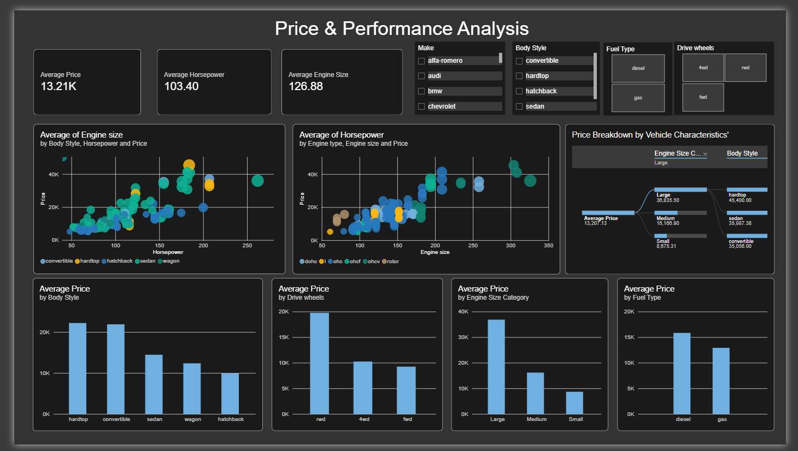
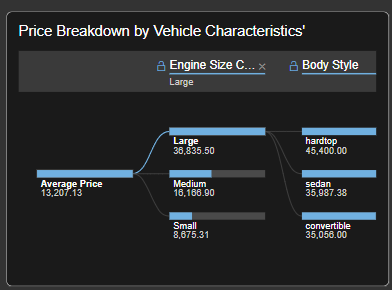

# 🚗 Automobile Specifications, Performance & Price Analysis (Power BI)

This project presents an interactive **Power BI dashboard** developed as a college Data Science project using an automobile dataset.

The project focuses on analyzing automobile specifications, performance characteristics, and fuel-efficiency indicators to identify relationships between vehicle characteristics and their **market price**.

The workflow covers the complete process from **data preprocessing and validation to transformation, DAX-based analysis, and interactive dashboard development**.

---

## 🎓 College Project

**Student Name:** `Zidane Raja A. Nadar`  
**Roll Number:** `TDS2627034`  


---

## 🎯 Objective

> **To analyze automobile specifications, performance, and fuel efficiency in order to identify relationships between vehicle characteristics and their market price.**

The dashboard uses automobile attributes such as engine size, horsepower, body style, fuel type, drive wheels, curb weight, and mileage to explore how these characteristics vary with vehicle price.

---

## ⚙️ Data Preparation

The dataset was prepared using **Power Query in Power BI** before building the dashboard.

### 🧼 Data Cleaning

- Duplicated the original dataset into two queries:
  - `Raw` – preserved the original dataset
  - `Clean` – used for cleaning and transformation
- Replaced `?` with `null` to correctly represent missing values.
- Removed `normalized-losses` because approximately 20% of its values were missing and it was not directly relevant to the project objective.
- Removed the 4 records with missing `Price`, since price is the dependent variable for this analysis.
- Retained the small number of missing values in `bore`, `stroke`, `horsepower`, and `peak-rpm`, since the remaining vehicle information was still useful for analysis.
- Verified that Power BI correctly handled null values during aggregations.

### 🔄 Data Transformation

- Corrected numerical and categorical data types after handling the `?` values.
- Created a numerical **Cylinder Count** column from the original textual `num-of-cylinders` field.
- Renamed columns for readability, for example:
  - `city-mpg` → `City MPG`
  - `highway-mpg` → `Highway MPG`
  - `engine-size` → `Engine Size`
  - `curb-weight` → `Curb Weight`
  - `drive-wheels` → `Drive Wheels`
- Created **Average MPG**:

```text
Average MPG = (City MPG + Highway MPG) / 2
```

- Created **Price Category** with:
  - Budget
  - Mid Range
  - Premium
- Created **Engine Size Category** with:
  - Small
  - Medium
  - Large

### 🔍 Data Validation

Power Query's **Column Quality**, **Column Profile**, and **Column Distribution** features were used to validate:

- Data types
- Missing values
- Errors
- Categorical consistency
- Numerical values
- Invalid or impossible values

After validation, the cleaned data was loaded into Power BI using **Close & Apply**.

### 🔁 Transformation & Validation Pipeline

```text
Source
   ↓
Promoted Headers
   ↓
Changed Data Types
   ↓
Replaced "?" with null
   ↓
Removed normalized-losses
   ↓
Removed rows with missing Price
   ↓
Trimmed / Cleaned Text
   ↓
Renamed Columns
   ↓
Created Cylinder Count
   ↓
Created Average MPG
   ↓
Created Price Category
   ↓
Created Engine Size Category
   ↓
Changed Data Types
   ↓
Column Quality & Profile Validation
   ↓
Close & Apply
```

---

## 📈 DAX Measures

The following measures were created for dynamic analysis:

- **Total Vehicles**
- **Average Price**
- **Average Horsepower**
- **Average Engine Size**
- **Average MPG**
- **Average City MPG**
- **Average Highway MPG**
- **Average Curb Weight**
- **Maximum Price**
- **Minimum Price**

These measures dynamically respond to slicers and filters applied in the dashboard.

---

# 📊 Dashboard Overview

The dashboard consists of **two interactive pages**.

---

## 🧾 1. Automobile Overview



The first page provides a high-level overview of the automobile dataset, combining KPIs, relationship analysis, price comparisons, and interactive filtering.

### 📌 KPIs

- Total Vehicles
- Average Price
- Average Horsepower
- Average MPG
- Average Curb Weight

### 🎛️ Slicers

Users can filter the analysis by:

- Fuel Type
- Drive Wheels
- Make
- Body Style
- Aspiration

### 📊 Visuals

1. **Scatter Chart** – Horsepower vs. Price by Body Style
2. **Scatter Chart** – Engine Size vs. Price by Fuel Type
3. **Pie Chart** – Vehicle Distribution by Price Category
4. **Column Chart** – Average Price by Body Style
5. **Column Chart** – Average Price by Make
6. **Column Chart** – Average Price by Fuel Type





---

## 🔎 2. Price & Performance Analysis



The second page focuses on investigating relationships between automobile specifications and market price.

### 📌 KPIs

- Average Price
- Average Horsepower
- Average Engine Size

### 🎛️ Filters

- Make
- Body Style
- Fuel Type
- Drive Wheels

### 📊 Visuals

1. **Scatter Chart** – Horsepower vs. Price by Body Style
2. **Scatter Chart** – Engine Size vs. Price by Engine Type
3. **Decomposition Tree** – Price Breakdown by Vehicle Characteristics
4. **Column Chart** – Average Price by Body Style
5. **Column Chart** – Average Price by Drive Wheels
6. **Column Chart** – Average Price by Engine Size Category
7. **Column Chart** – Average Price by Fuel Type

### 🌳 Decomposition Tree

The decomposition tree provides an interactive breakdown of **Average Price** according to vehicle characteristics such as engine-size category and body style.



---

## 🎛️ Interactive Filtering

The dashboard uses Power BI slicers to allow users to explore the dataset from different perspectives.

For example, the dashboard can be filtered by individual manufacturers or vehicle configurations to investigate how the overall analysis changes.


---

## 🧠 Key Observations

The dashboard provides the following descriptive observations from the dataset:

- Vehicle price varies across manufacturers and body styles.
- Larger engine-size categories have higher average prices in this dataset.
- Rear-wheel-drive vehicles have a higher average price than front-wheel-drive vehicles in the analyzed data.
- Diesel vehicles have a higher average price than gasoline vehicles in this dataset.
- Horsepower and engine size show visible positive relationships with vehicle price.
- The Price Category visualization shows the distribution of vehicles across Budget, Mid Range, and Premium groups.

> **Note:** These are descriptive patterns within this dataset. They should not be interpreted as proof that a particular vehicle characteristic directly causes a change in market price.

---

# ✨ Power BI Features Demonstrated

This project demonstrates the use of multiple Power BI capabilities:

- **Power Query** for data cleaning and transformation
- Data type conversion
- Missing-value handling
- Conditional columns
- Custom columns
- Column quality and profiling
- **DAX measures**
- KPI cards
- Scatter charts
- Column charts
- Pie charts
- **Decomposition Tree**
- Interactive slicers
- Dynamic filtering
- Conditional formatting
- Categorical data transformation

---

# 🚀 How to Use

1. Clone or download this repository.
2. Open the `.pbix` file using **Power BI Desktop**.
3. If required, update the dataset/file path in Power Query.
4. Refresh the data.
5. Explore both dashboard pages using the slicers and interactive visuals.

---

# 📁 Project Structure

```text
Automobile-PowerBI-Dashboard/
│
├── Automobile-Analysis.pbix
│
├── Data/
│   └── Automobile_data.csv
│
├── images/
│   ├── Filtered Page 1 Analysis for Honda Make.png
│   ├── Filtered Page 1 Analysis for Nissan fwd.png
│   ├── Page 1 Price analysis.png
│   ├── Page 1 kpis.png
│   ├── Page 1 Overview.png
│   ├── Page 2 Price breakdown by vehicle characteristics.png
│   └── Page 2 overview.png
│
└── README.md
```

---

## 🛠️ Tools & Technologies

- **Microsoft Power BI Desktop** – Dashboard development and visualization
- **Power Query** – Data cleaning, transformation, and validation
- **DAX** – Measures and dynamic calculations
- **CSV** – Source dataset

---

## 🎓 Academic Project

This project was developed as a **college Data Science / Business Intelligence project** to demonstrate practical skills in:

- Data preprocessing
- Data validation
- Data transformation
- Exploratory data analysis
- Data visualization
- DAX
- Interactive dashboard development
- Analytical thinking

---

## 👤 Author

**Name:** `[YOUR NAME]`  
**Roll Number:** `[YOUR ROLL NUMBER]`  
**Course:** `[YOUR COURSE]`  
**College:** `[YOUR COLLEGE NAME]`

---

## ⭐ Project

If you found this project useful or interesting, feel free to ⭐ the repository.
